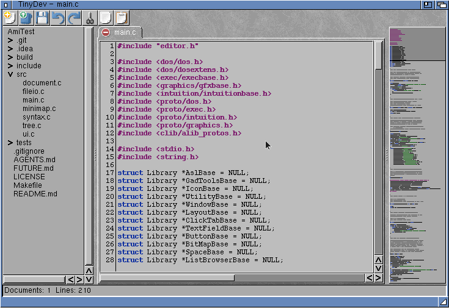

# TinyDev

TinyDev is a compact native AmigaOS 3.2 multi-document text editor. Each
closable tab owns a ReAction `texteditor.gadget`, providing native selection,
clipboard, undo/redo, scrolling and line numbers. Built-in highlighting covers
C/C headers (`.c`, `.h`) and AmigaDOS scripts (`.script`, `.dos`). Other files
remain plain text.

A simple minimap and a file browser are included.

In the future, TinyDev aims to be a simple but complete development environment
for AmigaOS 3.2.
It should support multiple languages via AmigaOS catalogues,
and multiple syntax parsers. It will also include features such as template system,
running build tools, and other external tools.

As you can guess, much of the code is AI-generated (using different models).
I will try to manually check and improve the generated code.

## Build and test

The default toolchain prefix is `/opt/amiga/bin/m68k-amigaos-`. Build with:

    make clean && make
    make test
    /opt/amiga/bin/m68k-amigaos-objdump -f build/TinyDev

The Makefile explicitly selects `-m68000 -msoft-float -noixemul` and creates the
Hunk executable `build/TinyDev`. All build artifacts are placed in the `build`
directory. Copy that file to the target and run it from Shell
with optional file arguments, or launch it from Workbench with project icons.

## Target requirements

- AmigaOS 3.2 and V47 `window.class`, `layout.gadget`, `clicktab.gadget`, and
  `texteditor.gadget`; editor scrollbars use `scroller.gadget`, the folder
  tree uses `listbrowser.gadget`, and the minimap uses `space.gadget`.
- `asl.library` and normal ReAction dependencies.
- AISS with its standard `TBImages:` assignment for toolbar imagery. If an
  individual image cannot be created, the corresponding toolbar action falls
  back to a text button.
- The editor area always uses the default screen font; there is no font
  selection.

Project supports New/Open/Save/Save As/Close/About/Quit, native edit commands,
horizontal scrolling without automatic line wrapping, line-number toggling,
safe temporary-file saves, duplicate-path tab activation,
and LF/CR/CRLF preservation. A status line spanning the full window width at
the bottom shows the number of open documents and the line count of the
currently displayed document. The AISS toolbar provides New, Open, Save,
Undo, Redo, Cut, Copy, and Paste. C highlighting recognizes standard C99 keywords,
strings/character constants, preprocessor lines, `//` comments, and block
comments. AmigaDOS keyword matching is case-insensitive and `;` begins a comment.
To keep scrollbar dragging as smooth as the gadget's own mouse-wheel scrolling,
syntax highlighting is suspended while a scrollbar is actively dragged and
restored (with a full redraw) once the drag ends.
An optional colored minimap can be toggled from the View menu. It appears as a
column on the right of the window (below the toolbar, beside the editor) and
renders the active document using the same syntax colors on the same grey
background the editor shows (the screen's `BACKGROUNDPEN`). It also draws a
simple frame with a slightly darker background that marks the vertically
visible portion of the editor; only the vertical range matters, so the box
always spans the full minimap width. This viewport is refreshed after a
scrolling operation completes (not while a scrollbar is being dragged) and
after a window layout change. The viewport overlay can also be dragged with the
mouse to scroll the editor: pressing and dragging inside the minimap moves the
visible region so it is centred on the cursor line, and (as with scrollbar
dragging) syntax highlighting is suspended while the drag is in progress and
restored, together with a viewport redraw, once the mouse button is released.
Rendering runs in a
separate background task so the editor stays responsive; nothing is rendered
while the minimap is hidden, updates are coalesced to the minimum (a single job
is ever outstanding), and the task is stopped cleanly on exit. Like the folder
tree, the minimap column is resizable: a WeightBar between the editor and the
minimap lets its width be dragged, and the render scales to whatever width the
column is given. The minimap
drawing area is framed by a raised bevel (drawn
with the screen's `SHINEPEN` and `SHADOWPEN`) so it reads as a distinct panel.
Every editor installs a white `GA_BackFill` hook plus an editor-local
`DrawInfo` whose background pen is white, and reserves black for normal text
with dark screen pens for keywords, strings, comments, and preprocessor lines.
Note that the AmigaOS 3.2 `texteditor.gadget` renders its text area with the
screen's `BACKGROUNDPEN` and ignores `GA_BackFill`/`GA_DrawInfo` there, while
its `GA_TEXTEDITOR_Pen`/`GA_TEXTEDITOR_ColorMap` attributes are unimplemented
and `GA_TEXTEDITOR_Transparent` is OS4-only; the text area therefore keeps the
Workbench background colour until a future gadget subclass overrides rendering.
Project/Open Directory populates a hierarchical folder tree; double-clicking a
file opens it in a tab. The tree is resizable and can be hidden from the View
menu. A selected base directory opens its first level immediately; child
directories start collapsed. Opening a child reads only its direct children;
closing it releases that subtree, so deeper levels are never scanned eagerly.
The visible tree is bounded to 16 directory levels and 2048 entries.

Version one intentionally treats contents as 8-bit text. UTF-8 decoding,
Unicode shaping, search/replace UI, user-configurable colors, sessions, font
selection, and arbitrary raw TrueType loading are not promised. A missing V47
class prevents startup. The minimap is a scaled color overview with
drag-to-scroll navigation via its viewport overlay.
